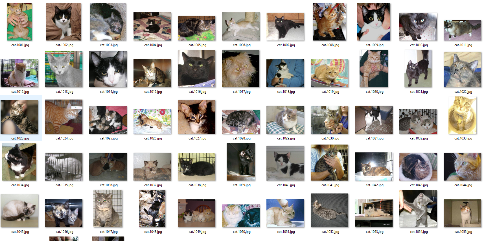
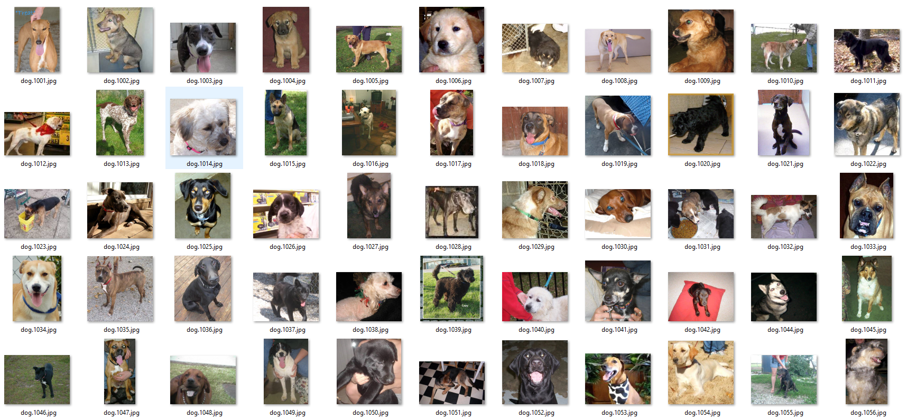
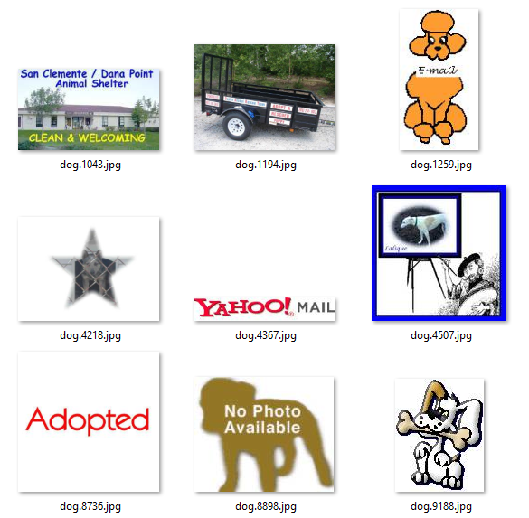
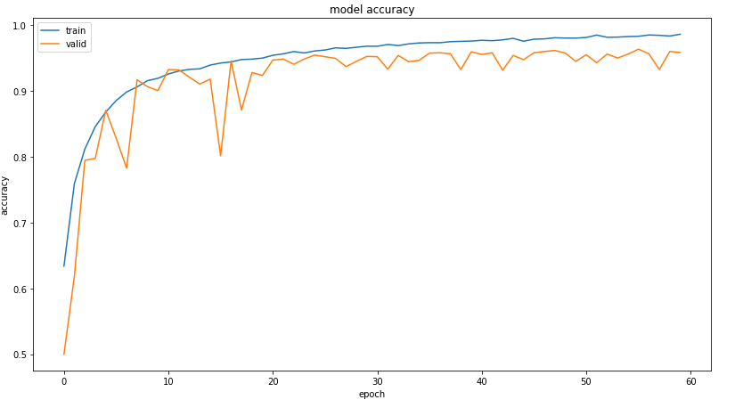
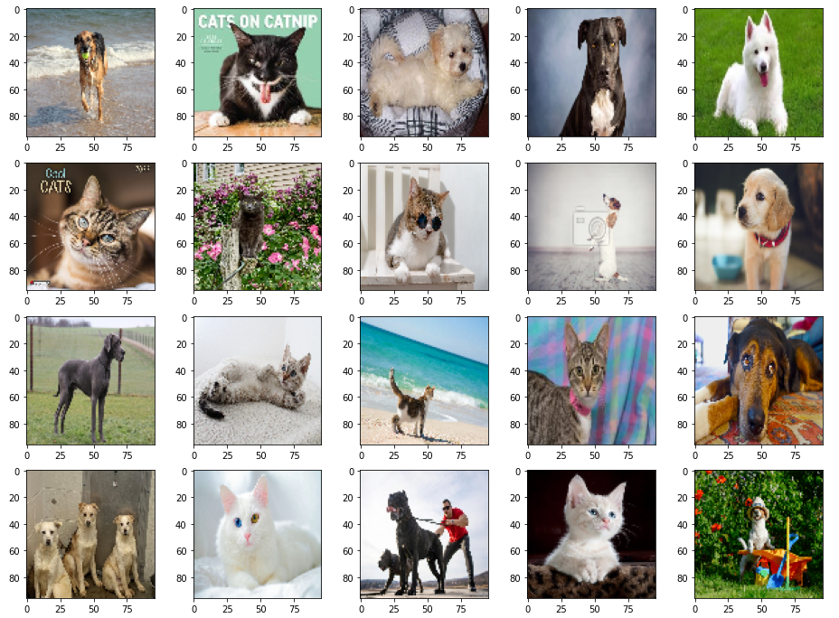
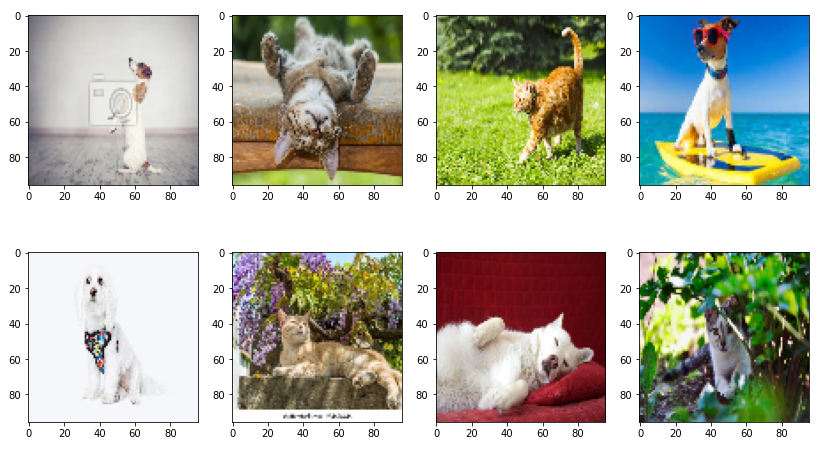

# Kaggle-dogs-and-cats (No transfer learning)

Dogs vs Cats classification for kaggle competition (95.5% accuracy on validation set 90% on test set).

Model was trained with simple convolution model (no transfer learning, ensemble, and state of the art architectures was used).

## Training and dataset

Model was trained on "kaggle cats vs dogs" dataset consisting of 25000 examples.

Dataset had about 90 wrong examples so it had to be cleaned of it.

Abnormal examples of dogs:

## Results

95.5% accuracy on validation set:

90% accuracy on test set (100 random cats and dogs images from google graphics):

Wrong predicted examples (test set):

Most wrong predicted examples is a little tricky. For example an upside down cat is very rare in dataset. Also the background of dog's images is often green (garden etc.), this may be the reason why some cats was recognized as dogs. Other examples are just difficult (The white dog on a red background has cat-like features).

## Conclusions

After many attempts on this dataset (using only the simplest conv architectures), the conclusions are as follows:

- MaxPooling2D is much better instead of stride=2 in conv layers (3-5% higher acc).
- Dropout with batch normalization after conv layers gives spectacular regularization effects (5-7% higher acc), contrary to what is commonly believed that dropout after covolution is bad.
- Doubling the number of parameters doesn't improove performence much.

